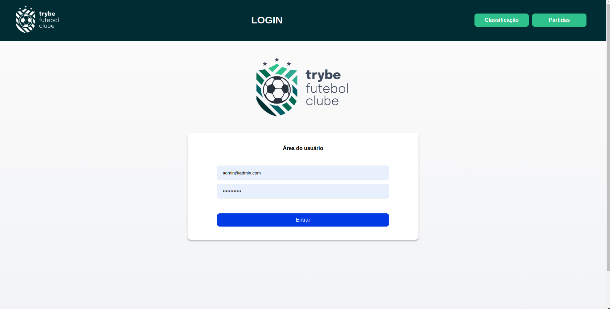
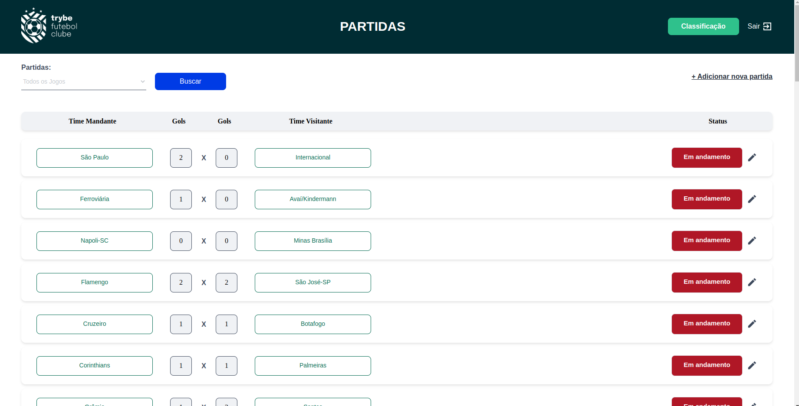
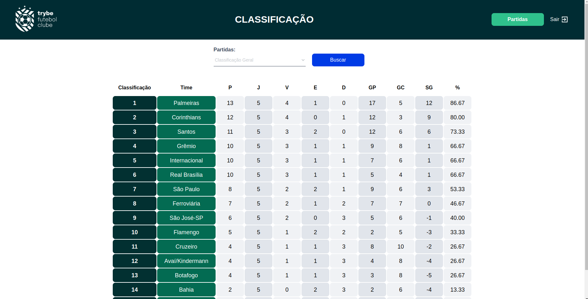

# :construction: README customizado em construção ! :construction:
<!-- Olá, Tryber!
Esse é apenas um arquivo inicial para o README do seu projeto no qual você pode customizar e reutilizar todas as vezes que for executar o trybe-publisher.

Para deixá-lo com a sua cara, basta alterar o seguinte arquivo da sua máquina: ~/.student-repo-publisher/custom/_NEW_README.md

É essencial que você preencha esse documento por conta própria, ok?
Não deixe de usar nossas dicas de escrita de README de projetos, e deixe sua criatividade brilhar!
:warning: IMPORTANTE: você precisa deixar nítido:
- quais arquivos/pastas foram desenvolvidos por você; 
- quais arquivos/pastas foram desenvolvidos por outra pessoa estudante;
- quais arquivos/pastas foram desenvolvidos pela Trybe.
-->
## Projeto Trybe futebol clube
- `Projeto do módulo de back-end, onde a Trybe disponibiliza o Front-end e o docker compose já pronto, bastando ao estudante desenvolver apenas o back-end`
## Para rodar a aplicação:
- `git clone git@github.com:reinaldoper/trybe-futebol-clube.git`
## Baixar as dependências:
- Dentro da pasta `raiz do projeto`
- `npm install`
- Dentro da pasta `app`
- `docker-compose up -d`
- Se tudo ocorrer dentro da normalidade, rode no terminal `http://localhost:3000`
Tela de login:

Tela de partidas:

Tela de classificação:

